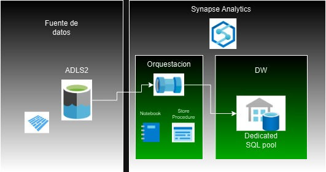
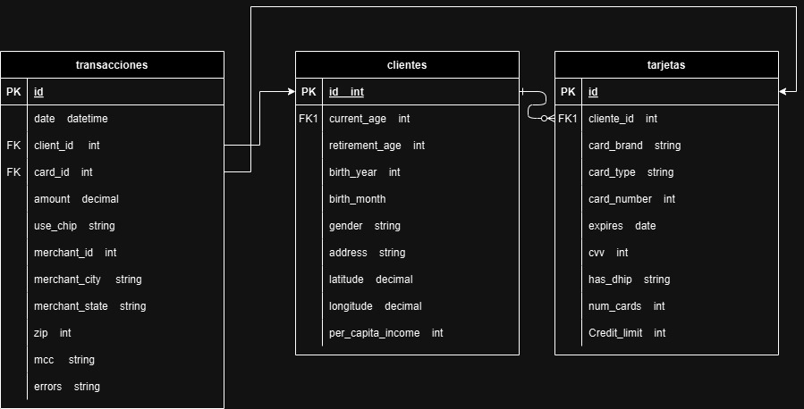
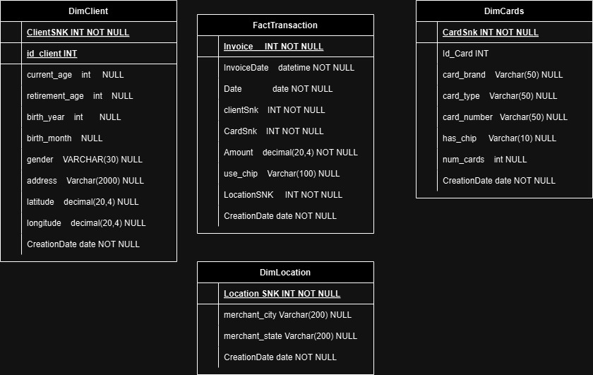

# Andrés Felipe López Arango PruebaTecnica_2025-03-14 

# Implementación de un Data Warehouse financiero en Azure

## Introducción
Implementar un proceso de integración y centralización de los datos transaccionales diarios de los usuarios de un banco en un entorno de Data Warehouse (DW), con el propósito de facilitar el análisis de negocio y la toma de decisiones estratégicas. Para ello, se utilizaron herramientas y servicios en el entorno de Azure Synapse Analytics, aprovechando un Data Lake para la ingesta y almacenamiento de los datos, y un proceso ETL para la transformación y carga de la información en un modelo optimizado para análisis.

## Arquitectura
Para la integración y centralización de los datos transaccionales, se emplearon diversos servicios de Azure, cada uno seleccionado estratégicamente por sus capacidades y ventajas específicas:
- Azure Data Lake Storage Gen2 (ADLS2): Se utilizó como repositorio principal para la ingesta y almacenamiento de los archivos de origen debido a su capacidad de gestionar datos estructurados, semiestructurados y no estructurados. Su arquitectura escalable y su integración nativa con Synapse permiten un acceso eficiente a los datos transaccionales, facilitando su procesamiento posterior.
- Azure Synapse Analytics: Se encargó de la gestión del Data Warehouse y la ejecución del proceso ETL. Synapse fue seleccionado por su capacidad de escalar horizontalmente, ofrecer un entorno unificado para análisis de datos, y optimizar consultas complejas a través de su motor distribuido, garantizando un alto rendimiento para la generación de reportes y análisis de negocio.
- Pipelines en Synapse: Se implementó un Pipeline para orquestar el flujo de trabajo de forma automatizada, asegurando la reproducibilidad del proceso. Aunque no se programó un Trigger en este ejercicio, se recomienda su configuración para cargas diarias, aplicando un enfoque de carga incremental mediante la identificación de nuevas transacciones a partir de un delta temporal.

A continuación se muestra el diagrama de la arquitectura. 

## Ingesta de datos
En esta etapa, se implementó el proceso de ingesta de datos desde archivos CSV hacia el entorno de Azure Synapse Analytics, utilizando un enfoque que optimiza la extracción y manipulación de grandes volúmenes de información:
- Origen: Los archivos CSV se almacenaron en el Data Lake dentro de la carpeta RAW, asegurando la separación entre datos en bruto y datos procesados. Dado el tamaño del archivo de transacciones (más de un millón de filas), se aplicó una transformación previa, convirtiéndolo a formato Parquet. Esto mejora el rendimiento al reducir el tamaño del archivo y optimizar su lectura en procesos posteriores.
- Destino: Se adoptó una estrategia basada en tablas externas en Synapse, aprovechando el motor de PolyBase para leer directamente desde el Data Lake. Esto permitió una extracción eficiente y la manipulación de los datos mediante consultas SQL, maximizando el rendimiento en entornos con grandes volúmenes de información.
Posteriormente, se aplicaron las transformaciones necesarias y se realizó la carga en el Data Warehouse (DW), adoptando una nueva estructura basada en un modelo estrella que facilita los análisis a nivel de negocio.

### Modelo Transaccional

### Modelo Estrella

## EDA
Previo a la implementación del proceso ETL, se llevó a cabo un análisis exploratorio de los datos (EDA) con el propósito de evaluar la calidad de la información y anticipar posibles transformaciones. Durante este análisis, se identificaron diversos aspectos clave:

- Tipos de Datos: Se verificó la coherencia entre los valores y los tipos de datos esperados, detectando discrepancias en campos como fechas, montos y códigos de identificación.
Valores Nulos: Se cuantificó la presencia de valores nulos en columnas críticas, evaluando su impacto en las futuras transformaciones.
- Errores de Formato: Se identificaron inconsistencias en el formato de fechas y montos, que requirieron corrección previa a la carga en el Data Warehouse.
- Duplicados: Se analizó la unicidad de los registros mediante la identificación de claves candidatas, lo que permitió implementar mecanismos de deduplicación durante la etapa de transformación.
- Distribución de Datos: Se evaluó la distribución de los registros en cada tabla para entender el volumen de información y detectar posibles outliers.

Este análisis permitió diseñar una estrategia de limpieza y transformación adecuada, asegurando la integridad y calidad de los datos antes de su incorporación al modelo estrella.

Durante el proceso de integración de los datos en el Data Warehouse (DW), se aplicaron diversas transformaciones para asegurar la calidad e integridad de la información, abordando problemas identificados durante el análisis exploratorio. A continuación, se describen los principales pasos realizados:

### 1. Corrección de Tipos de Datos:

- Se ajustaron los tipos de datos en campos clave, como las fechas, aplicando conversiones a DATETIME para garantizar la correcta interpretación de los valores temporales.
- Los campos numéricos, como montos y límites de crédito, se convirtieron a tipos adecuados como FLOAT o DECIMAL, facilitando operaciones aritméticas en las consultas.

### 2. Gestión de Valores Nulos:

- Se identificaron columnas críticas que no debían contener valores nulos, como los IDs de clientes y tarjetas.
- Para estos casos, se aplicó una estrategia de sustitución de nulos, asignando valores predeterminados como 0 o -1 para mantener la integridad de las claves foráneas y evitar rupturas en el modelo relacional.
- En campos no críticos, los nulos se mantuvieron o se reemplazaron por el valor "Indeterminado", facilitando la interpretación en futuros análisis.

### 3. Eliminación de Duplicados:

- Se implementó una estrategia para la carga de dimensiones donde solo se insertaron registros únicos, evitando duplicados al crear las tablas dimensionales.
- En el caso de la tabla de hechos, se aplicó una lógica de carga incremental, asegurando que cada transacción se registre una sola vez.

### 4. Generación de Claves Únicas (Super Natural Key - SNK):

- Se crearon Super Natural Keys (SNK) para cada dimensión, permitiendo identificar de forma única cada registro y optimizando la búsqueda y el cruce de información entre la tabla de hechos y las dimensiones.
- Estas claves se generaron a partir de combinaciones de atributos clave, garantizando unicidad en los registros.

### 5. Validación Final:

- Se realizaron controles de calidad posteriores a la limpieza, validando la cantidad de registros, la coherencia de los tipos de datos y la ausencia de duplicados en las dimensiones y la tabla de hechos.

Con estas acciones, se garantizó que la información cargada en el DW cumpliera con los estándares de calidad, optimizando tanto el rendimiento de las consultas como la fiabilidad de los análisis posteriores.

## Transformación de datos
Dado que los datos iniciales se encontraban en estado bruto, se identificaron diversos problemas de calidad, tales como la presencia de valores nulos, registros duplicados, formatos incorrectos de fecha y tipos de datos inconsistentes. Para abordar estas situaciones, se implementó un proceso de transformación centrado en la limpieza, desnormalización y optimización de la información, con el objetivo de estructurar los datos en un modelo estrella compuesto por tablas de dimensiones y una tabla de hechos.
- Creación de dimensiones: La generación de las dimensiones se llevó a cabo mediante Stored Procedures (SP) en el Data Warehouse (DW), los cuales realizaron la carga de datos con las respectivas validaciones de calidad y la aplicación de claves únicas utilizando el concepto de Super Natural Key (SNK). Se construyeron las siguientes dimensiones:
  
 DimClients:Contiene información detallada de los clientes del banco, como edad, género, ingresos.
 
 DimCards: Almacena los tipos de tarjetas emitidas por el banco, clasificadas por marca, tipo de producto y características de seguridad.
 
 DimLocation: Centraliza las ubicaciones de las transacciones, permitiendo el análisis geográfico de los movimientos financieros.

- Creación de la tabla de hechos: De manera similar, la carga de la tabla de hechos se realizó a través de un Stored Procedure que incorporó transformaciones adicionales, tales como la integración de las Super Natural Keys (SNK) generadas en las dimensiones.
  
La granularidad de esta tabla se definió a nivel de cada transacción realizada en el banco, lo que permite responder preguntas analíticas como:

 Cantidad de transacciones diarias.
 
 Montos totales transferidos por cliente.
 
 Distribución de las transacciones por ubicación.
 
 Identificación de las transacciones de mayor valor.
 
Este enfoque facilita la exploración de los datos a distintos niveles de agregación y potencia los análisis de negocio, proporcionando una estructura optimizada para la integración con herramientas de inteligencia de negocios, como Power BI.

## Automatización con Pipelines
- Pipeline Principal: Orquesta la ejecución de los procedimientos almacenados para la carga de dimensiones y hechos.
- Manejo de Errores: Validación de la correcta ejecución de cada paso, con posibilidad de reintentos.

## Resultados y validación
Finalmente se realiza diversas consultas al DW, verificando la calidad de los datos, los tipos de datos y validando que la información se haya agregado de forma congruente y correcta. 

## Herramientas utilizadas
Se agrega los scripts de SQL para la creación de las tablas externas, las tablas del DW y para la creación de los SP.
Se agrega los notebook para la conversión de CSV a PARQUET y para el analisis del EDA.

## Manejo de Excepciones y Registro de Logs
En un entorno de procesamiento de datos como el implementado en Azure Synapse Analytics, es fundamental contar con un mecanismo de administración de excepciones y registro de logs que permita supervisar la ejecución del proceso ETL, identificar posibles errores y garantizar la trazabilidad de los datos.

De haber implementado este manejo, se habría considerado lo siguiente:

### 1. Estructura de Carpetas:
Se habría creado una carpeta específica dentro del proyecto en el Data Lake o en la estructura del repositorio de código, denominada algo como:
- logs
- exceptions
- monitoring

Esta estructura permitiría centralizar la administración de registros, separando los logs de ejecución y las excepciones de los datos procesados.

### 2. Registro de Ejecuciones:
- Se habría implementado un mecanismo para registrar el inicio y fin de cada ejecución del pipeline, documentando el tiempo de procesamiento y la cantidad de registros procesados.
- Esto se lograría mediante la creación de una tabla de auditoría.

### 3. Integración con Pipelines:
- En el Pipeline de Synapse, se habría agregado una actividad para registrar el inicio y fin de cada ejecución, con capturas de errores personalizadas y envío de notificaciones en caso de fallos.
- También se podrían haber configurado alertas a través de Azure Monitor para notificar eventos críticos.

### 4. Consutal de logs:
- Finalmente, se habría diseñado un conjunto de consultas o vistas que permitieran inspeccionar rápidamente los errores registrados, facilitando la identificación de cuellos de botella y la mejora continua del proceso.

Con la implementación de estas prácticas, se habría logrado un sistema de auditoría robusto, capaz de proporcionar visibilidad en todo el ciclo de vida del ETL, desde la ingesta hasta la carga en el DW, facilitando la detección y resolución de errores de manera oportuna.

## Escenario de mayor alcance.
### 1. En dado caso que los datos se incrementaran a 100x.
Mantendría la misma arquitectura, pero con mejoras clave para manejar la escalabilidad:
- Optimización del Almacenamiento: Agregaría una Landing Zone en el Data Lake para almacenar los archivos CSV en bruto. Posteriormente, se implementaría un proceso de transformación a formato Parquet, lo que reduce el tamaño de almacenamiento y optimiza la lectura mediante las tablas externas.
  
- Distribución de Datos en el DW: Consideraría cambiar el esquema de distribución en el SQL Pool:
  
  Para grandes volúmenes de datos, utilizaría la distribución tipo Hash sobre la clave principal de la tabla de hechos, lo que balancea la carga entre los nodos de procesamiento.

  Aplicaría un Clustered Columnstore Index en las tablas de hechos para mejorar la compresión y acelerar las consultas analíticas.

- Procesamiento Incremental: Implementaría una estrategia de carga incremental, donde solo se procesen los nuevos registros desde la última ejecución, minimizando el tiempo de procesamiento.

### 2. Los pipelines seria necesario una ejecución daria.
- Trigger Diario: Configuraría un Trigger que ejecute el pipeline en una ventana de tiempo específica, idealmente fuera del horario de mayor actividad del sistema, asegurando que todas las transacciones se hayan registrado antes de la carga.
- Procesamiento Incremental: Utilizaría un enfoque basado en un delta temporal o un campo de timestamp de creación/actualización para filtrar solo los nuevos registros. Esto reduciría el volumen de datos procesados diariamente y optimizaría el tiempo de ejecución.
- Control de Errores: Agregaría mecanismos de control en el pipeline, como la validación de la correcta ejecución de cada paso y la creación de alertas en caso de fallos.

### 3. Si la base de datos necesitara ser accedido por más de 100 usuarios funcionales.
En este caso, podria tener varias opciones:
- Particionamiento de la Tabla de Hechos: Implementaría un esquema de particionamiento por campos temporales, como fecha de transacción, con granularidad mensual o trimestral. Esto permitiría que las consultas lean solo las particiones necesarias, reduciendo tiempos de respuesta y minimizando bloqueos.
- Optimización de Consultas: Utilizaría vistas materializadas o sinónimos para exponer los datos de forma simplificada a los usuarios funcionales, reduciendo la carga sobre las tablas principales.
- Carga de Trabajo Separada: Si la concurrencia se vuelve un cuello de botella, consideraría la creación de réplicas de solo lectura en otro SQL Pool para distribuir la carga de consultas.

### 4. Si se require analítica en tiempo real.
Para soportar análisis en tiempo real, complementaría la arquitectura con nuevos componentes:
- Event Hub o IoT Hub: Para la ingesta de eventos en tiempo real directamente desde los sistemas transaccionales.
- Stream Analytics: Para procesar flujos de datos en tiempo real, aplicando transformaciones rápidas y cargando resultados directamente en el Data Warehouse o en una base de datos optimizada para lecturas rápidas, como Cosmos DB o Azure SQL Hyperscale.
- Modelo Semántico: Implementaría un modelo semántico optimizado en Power BI que se conecte al DW o a las fuentes de datos en tiempo real, habilitando paneles de control con actualización continua.
- Particionamiento Dinámico: En la tabla de hechos, aplicaría un esquema de particionamiento dinámico para que los nuevos registros se agreguen a una partición activa, evitando bloqueos en las consultas de lectura.

  De esta manera, se lograría una arquitectura híbrida que permita análisis en tiempo real sin afectar el rendimiento de las cargas batch. 
